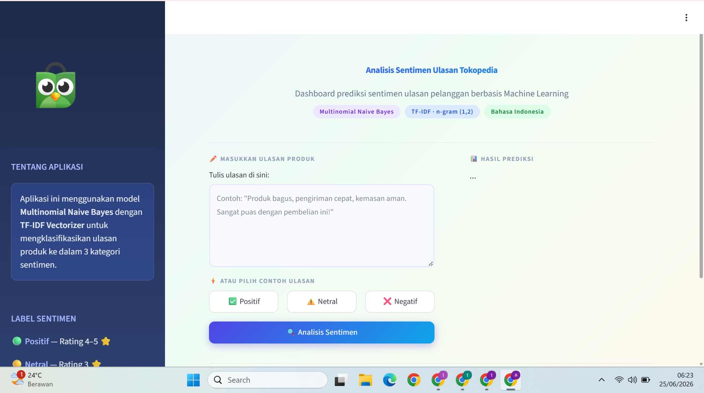
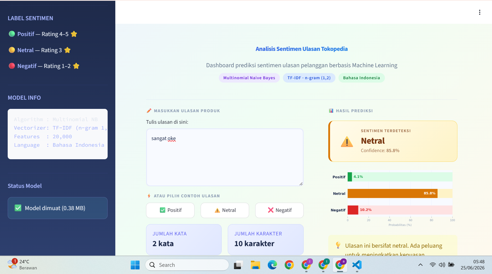

# Tokopedia Review Sentiment Analysis

A machine learning project that classifies Tokopedia product reviews into three sentiment categories — **Positive**, **Neutral**, and **Negative** — using TF-IDF feature extraction and Multinomial Naive Bayes. The best-performing model is deployed as an interactive dashboard using Streamlit.

> This project was developed as a final project for my Independent Study program at PT. SEVEN VINIX AURUM, as a hands-on exercise in applying end-to-end machine learning: from raw data to a deployed, interactive application.

## 📌 Overview

- **Task**: Multi-class text classification (sentiment analysis)
- **Labels**: Positive, Neutral, Negative
- **Data**: 65,543 Tokopedia (Indonesian e-commerce platform) product reviews
- **Approach**: TF-IDF vectorization + comparison of 3 ML algorithms across 2 feature-size configurations (6 experiments total)
- **Output**: Best model serialized and deployed via an interactive Streamlit dashboard, tunneled publicly with ngrok

## 📂 Dataset

- **Source**: [Tokopedia Product Reviews 2025](https://www.kaggle.com/datasets/salmanabdu/tokopedia-product-reviews-2025) by Salman Abdu (Kaggle)
- **License**: MIT
- **Access method**: Downloaded via Kaggle API
- **Raw size**: 65,543 rows × 13 columns (review text, rating, product info, price, shop ID, etc.)

```python
# Downloading the dataset via Kaggle API
!kaggle datasets download -d salmanabdu/tokopedia-product-reviews-2025 --unzip -p /content/data/
```

*The dataset is not re-uploaded in this repository — please download it directly from the Kaggle link above.*

### Sentiment Labeling

Sentiment labels were derived programmatically from the review `rating` column rather than using the dataset's pre-existing label field, to keep the labeling logic transparent and reproducible:

| Rating | Sentiment |
|---|---|
| > 3 | Positive |
| = 3 | Neutral |
| < 3 | Negative |

## ⚙️ Methodology

### 1. Text Preprocessing
- Lowercasing
- URL removal
- Non-alphabetic character removal (numbers, symbols, punctuation)
- Whitespace normalization
- Short-token removal (words < 2 characters)

### 2. Handling Class Imbalance
The raw dataset is heavily imbalanced — **97.5% Positive, 1.2% Negative, 1.2% Neutral**. Training directly on this distribution caused the model to collapse into predicting only the majority class (F1-Macro ≈ 0.35).

**Solution — Balanced Sampling**: 700 reviews were sampled per class (capped by the minority classes' actual availability of 791 rows after cleaning), producing a perfectly balanced dataset of **2,100 rows** (33.3% per class).

### 3. Train/Test Split
- 80/20 stratified split → 1,680 training rows, 420 testing rows

### 4. Feature Extraction & Model Comparison
TF-IDF vectorization (`ngram_range=(1,2)`, `min_df=2`, `max_df=0.95`, `sublinear_tf=True`) combined with 3 classifiers, each tested at two feature-size configurations — **6 experiments total**:

| Model | max_features |
|---|---|
| Multinomial Naive Bayes (α=0.1) | 3000 / 5000 |
| Random Forest (n_estimators=100) | 3000 / 5000 |
| XGBoost (n_estimators=100) | 3000 / 5000 |

Each configuration was evaluated with Accuracy, F1-Macro, F1-Weighted, and 5-fold cross-validation.

### 5. Model Selection & Serialization
The best model (by F1-Macro) was serialized with `pickle` as a single pipeline object (TF-IDF Vectorizer + classifier) and reload-verified with a sanity check before deployment.

## 📊 Results

### Model Comparison

| Model | Accuracy | F1-Macro | F1-Weighted | CV Mean | CV Std |
|---|---|---|---|---|---|
| **Naive Bayes (max_features=5000)** ⭐ | **69.05%** | **0.6968** | **0.6968** | 66.95% | ±2.50% |
| Naive Bayes (max_features=3000) | 68.81% | 0.6938 | 0.6938 | 66.52% | ±2.78% |
| XGBoost (max_features=5000) | 63.10% | 0.6356 | 0.6356 | 64.86% | ±1.91% |
| XGBoost (max_features=3000) | 63.10% | 0.6341 | 0.6341 | 65.00% | ±1.89% |
| Random Forest (max_features=3000) | 63.81% | 0.6315 | 0.6315 | 65.29% | ±3.61% |
| Random Forest (max_features=5000) | 63.33% | 0.6254 | 0.6254 | 64.38% | ±2.55% |

**Best model: Multinomial Naive Bayes (max_features=5000)**

### Per-Class Performance (Best Model)

| Class | Precision | Recall | F1-Score | Support |
|---|---|---|---|---|
| Negative | 0.63 | 0.68 | 0.65 | 140 |
| Neutral | 0.57 | 0.62 | 0.59 | 140 |
| Positive | 0.93 | 0.77 | 0.84 | 140 |
| **Macro avg** | **0.71** | **0.69** | **0.70** | 420 |

**Key observations:**
- **Positive** is the strongest class (Precision 0.93) — when the model predicts Positive, it's correct 93% of the time.
- **Negative** and **Neutral** are frequently confused with each other, which is expected linguistically: 3-star ("Neutral") and 1–2 star ("Negative") reviews often use similar phrasing (e.g. "kurang memuaskan", "biasa saja").
- Balanced sampling improved the model from only being able to detect the Positive class (F1-Macro 0.35) to detecting all three classes fairly (F1-Macro 0.70).

## 🖥️ Dashboard Preview





**Dashboard features:**
| Feature | Description |
|---|---|
| Text Input | Free-text box for entering a review |
| Predict Button | Triggers model inference |
| Prediction Result | Sentiment label + confidence score + gauge chart |
| Probability Visualization | Bar chart of prediction probability per class |
| Custom UI | Gradient background, styled sidebar with model info |

## 🚀 How to Run

This project was developed and run entirely in **Google Colab** (data download, training, and deployment all in one notebook).

1. Open `Copy_of_projek_akhir_vinix.ipynb` in Google Colab
2. Set up Kaggle API credentials (via Colab Secrets or manual input) and download the dataset
3. Run all preprocessing, training, and evaluation cells
4. The best model is serialized to `model_tokopedia.pkl`
5. The Streamlit dashboard script (`app.py`) is generated in-notebook via the `%%writefile` magic command
6. Run the deployment cell to launch Streamlit and expose it publicly via ngrok:

```python
# Streamlit runs in the background, then tunneled via ngrok
streamlit run app.py --server.port 8501 &
# ngrok auth token entered securely at runtime (not hardcoded)
```

> ⚠️ **Note**: The public ngrok URL is only active while the Colab notebook session is running — it is not a permanent hosted deployment. The notebook must be re-run to generate a new active link.

## 🛠️ Tech Stack

- **Language**: Python
- **Data processing**: Pandas, NumPy, Regular Expressions (re)
- **Modeling**: Scikit-learn (TF-IDF, Naive Bayes, Random Forest, Label Encoding), XGBoost
- **Visualization**: Matplotlib, Seaborn
- **Dashboard**: Streamlit
- **Deployment/Tunneling**: pyngrok
- **Environment**: Google Colab

## 👤 Author

**Athifah Nur Rahman MD**
Information Systems Student, Hasanuddin University
📧 athifaahnur145@gmail.com
🔗 [GitHub](https://github.com/athifaahnr) | [Portfolio](https://athifaahnr.github.io/) | [LinkedIn](www.linkedin.com/in/athifah-n-rahman-184164353)
